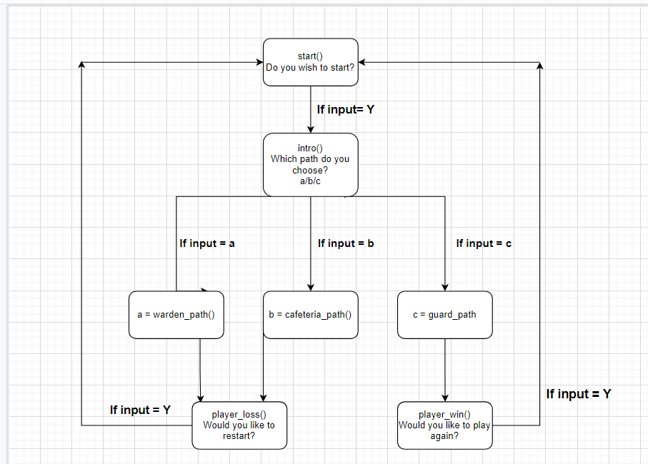
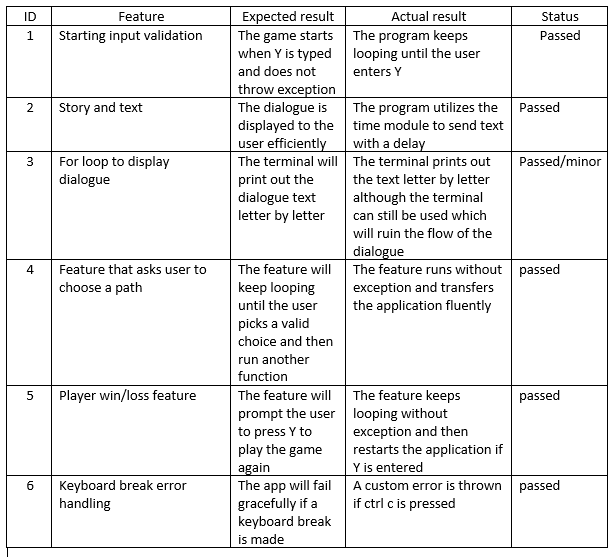

# **Development Plan - Python Terminal Application**

## **Software Development Plan**

For my application I have chosen to create a text-based adventure game named "Escape From the Depths". The application will provide users with multiple choices and the user will have to navigate to the end of the story, ending up as a win or a loss depending on the users choices. The applications main intent is to give users an exciting and suspensful experience. It will give users an entertaining and fun interaction with Python and further showcases the  limitless things you can do with pythons tools. The main problem it will solve is curing boredome for any user that plays it, the simplicity and non-complicated aspects allows it to be played by any audience. Although, because games are normally played by a younger generation, this is the demographic it will target to mostly. It gives the intended audience a relaxed and entertaining break from the stresses of real life and gives them a fun experience. 

## **List of features:**

### 1. _**Starting input validation feature:**_  
At the very start of the application I decided to create a while loop that keeps asking the player if they want to start the game until they type Y or y. I made this feature because I believe it is a suitable input feature for the start of any game. I have also turned this feature into a function as I will be utilising it with the win and loss feature and this makes it easier to call it.

**User interaction and Experience:**
The user will find out how to use this feature because it gives clear instructions on what to do, type Y. The user just has to type Y or y into the terminal and the game will start. I made it accept the lower case "y" aswell because I didn't want it to be too picky. I added a try and except block to handle errors. Because it is a while loop it keeps looping until the user types Y so the only real error I had to take into consideration was a KeyboardInterrupt so that's what I added into the except block so it fails gracefully. If the user does select the wrong key I have added a form of error message that states again that they must press y if they want to play.

### 2. _**Text and Dialogue Feature:**_
Throughout the whole application I have integrated print statements that are used to show the user what is happening in the story, what choices they can make and also used to show dialogue from different characters. 

**User interaction and Experience:**
The user will interact with this feature by reading what the application is telling them. Throughout the application I have used the "time" module between each line of text. I have done this because it adds to the user experience by reading out the text line for line without having all the text dumped into one big block. This is done by adding a small 2 or 3 second delay between each line of text (time.sleep(3)). This allows for easier reading and increases the suspense of the game. The dialogue I have implemented also utilises the time and sys module however I have used a 'for' loop to read out the dialogue letter by letter to the user. I used this because it distinguishes dialogue from normal text and also allows for a more realistic showcase of dialogue, instead of a full line of text it prints it out one by one, essentially like hearing it in real time. I have also turned all the segments of text into functions, I have done this because it allows me to fluently link the different choices together and overall connects the application into one big block. I have also added a \a statement in some parts to replicate the bang sounds, this is to add more flare to the application and give players a more interactice experience. Becuase this feature doesn't necasarily require the users to physically interact, I have added a KeyboardBreak except block so it fails gracefully if the users decide to press control-c.

### 3. _**User choice feature:**_

A major feature I have constructed for my application is the user choice feature. This feature first displays text showing the user where they are in the stort with print statements and time.sleeps to make the text more readable. It them displays the user a list of 3 different options they can choose and asks them to make a decision on what path they want to take. Once the player selects a path it will redirect them to a another function in relation to what they selected. I have made the selections available by first assigning them into a list ["a","b","c"] to make sure the application is aware that these options exist and it allows me to link it to the while loop. I have then made a while loop that asks the user to select 1 of the 3 to progress to that path. I have put all of this into a function so its easier to call, also depending on what the user chooses, each path is connected with if statements that allow fluent redirection of functions.

**User interaction and Experience:**
The user will interact with this feature by reading the text and making their own judgement on where they want to progress. The user just has to type in the letter they wish to choose. The list I assigned lets the program know that if the user selects something that isn't in the list then it keeps running until they do. This is some error handling I have integrated into the program so that the program will not throw an exception to the user even if they enter wrong text. I have also added an f string to print to the user what path they choosed, I did this because it allows for a more concise user experience.

### 4. _**Player Win/Lose Feature:**_

Another set of features I have added is a function that runs when the player wins or loses. This function will tell the users through print statements if they have won or lost and provide them with an option to play again if they want. I have made a while loop input validation that keeps looping till they type y, and once they do the application loops back to the start of the game to play again. I made these into their own functions so that it is easier to connect them to the win and loss paths, while also allowing the program to fluently progress through the application.

**User interaction and Experience:**
The user will interact with this feature by entering the correct key if  they wish to restart the game. The loss and win feature tells the user what to do and will only continue if they enter the letter y. This is a form of error handling I have used so that the application doesn't throw an exception if they enter the wrong key. Although if the user does select the wrong key I have programmed it to show a different message that should be more concise to the user.

## **Flow Diagram for the Application**

